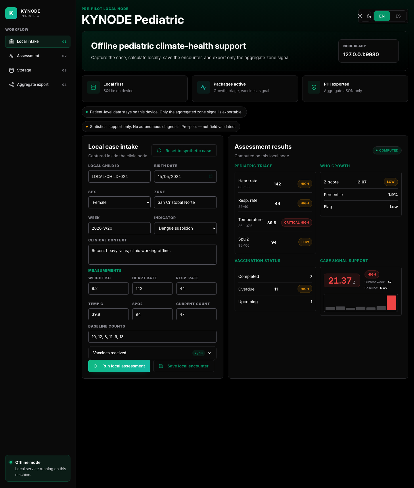
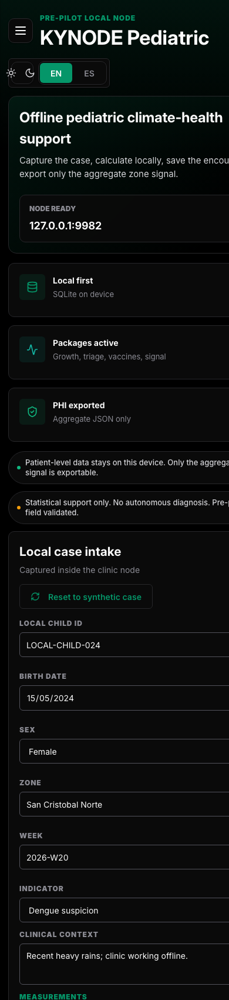
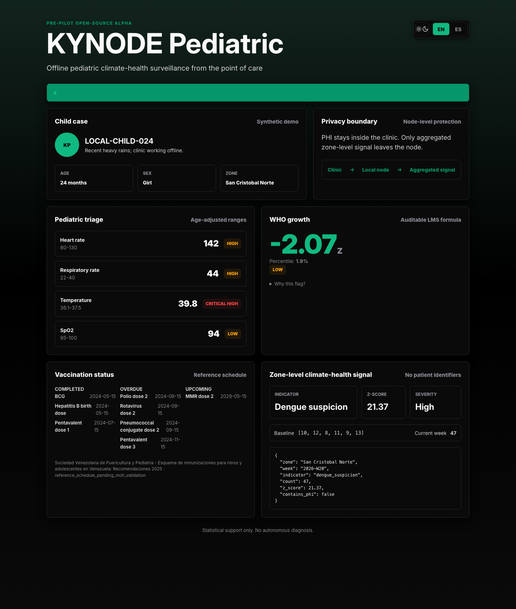

# KYNODE Pediatric

[](https://github.com/KynodeHealth/kynode-pediatric/actions/workflows/ci.yml)
[](https://github.com/KynodeHealth/kynode-pediatric/actions/workflows/ci.yml)
[](https://pediatric.kynode.io/)
[](https://kynodehealth.github.io/kynode-pediatric/)
[](LICENSE)
[](apps/local-node/pyproject.toml)
[](#status)

[English](README.md) · [Español](README.es.md)

Open-source pediatric climate-health surveillance, built from the point of care.

We are building this from the reality of clinics in Venezuela where intermittent connectivity is normal, not exceptional. KYNODE Pediatric runs on a small computer inside the clinic, works without internet, and turns the workflows nurses and community health workers already do every day - triage, growth measurement, vaccination, recognition of danger signs - into an early signal for climate-sensitive child health: dengue after heavy rains, diarrheal disease after flooding, heat-related illness during heat waves, respiratory outbreaks when air quality drops.

The module sits on top of [KYNODE](https://kynode.io), a proprietary edge health information system that already runs in rural and semi-urban Venezuela. We are releasing the pediatric layer under Apache 2.0 because the population it serves — children under five in disconnected, climate-vulnerable settings — has a stronger case for free access than for revenue capture.

## How it works

The repo is intentionally small. Four packages work today in alpha form; the IMCI rule package is still grant-funded work. These components organize pediatric signals for clinician review and aggregate surveillance. They do not make clinical decisions.

1. **Pediatric triage.** Vital sign ranges by age. A 2-year-old gets thresholds for a 2-year-old, not the same thresholds we use for an adult. Captures structured data at the front desk — input layer for everything else.
2. **WHO growth curves.** Weight, height and BMI percentiles for 0-60 months, calculated locally from a bundled WHO LMS reference table. The alpha ships with compact offline tables and interpolation, so it works with no internet. Feeds growth-status and nutrition surveillance; formal acute malnutrition assessment requires weight-for-height/length or MUAC and is not claimed in this alpha.
3. **Vaccination schedule.** Configurable per country. The alpha ships with a Venezuela reference schedule based on SVPP 2025, pending ministerial validation before field deployment. Feeds coverage and equity-gap surveillance per zone.
4. **IMCI danger sign alerts.** Deterministic rules from the WHO Integrated Management of Childhood Illness protocol. This package is planned after the grant decision and will stay rule-based.
5. **Anomaly detection.** Weekly comparison of aggregated, anonymized indicators per zone against rolling baseline. Flags climate-sensitive disease clusters — dengue, malaria, diarrheal disease, heat-related illness, respiratory outbreaks — before they reach reportable thresholds in the slow monthly system. Statistical, not ML. Fully auditable.

Identifiers are stripped at the node before anything reaches the cloud. Patient PHI never leaves the clinic. Only the surveillance signal travels.

## What's already built

The packages in this repo are not greenfield work. They extract pediatric clinical logic that has been running inside the proprietary KYNODE edge platform for months:

- **WHO Z-Score calculator** with LMS tables — in production in KYNODE since March 2026, used by the clinical calculation flow.
- **Age-banded pediatric vital sign reference ranges** — in production in the KYNODE consultation flow since March 2026.
- **Epidemiological trends radar with weekly aggregation** — in production in our cloud dashboard since March 2026.

This alpha turns those pieces into standalone Apache 2.0 packages (`growth-curves`, `triage-ranges`, `anomaly-detection`), adds a new `vaccinations` package based on a public Venezuela immunization reference, and ships a small bilingual demo that consumes the four packages end-to-end. A fifth package (`imci-rules`) is specified and ships after the grant decision.

We chose to open-source the pediatric layer specifically because the population it serves has the strongest case for free access. The rest of the KYNODE platform (cloud, sync, AI inference pipeline, hardware integration) remains proprietary.

## How this fits with DHIS2, OpenMRS and other existing tools

We are not trying to replace DHIS2, OpenMRS, CommCare or CHT. Those tools are excellent and widely used.

KYNODE Pediatric is for the case those tools handle worst: clinics that go weeks without internet, with no central server within reach, where the data has to live and be useful entirely on a small computer inside the clinic itself, and where the surveillance signal still has to make it upstream when the clinic eventually reconnects.

In practice, KYNODE Pediatric and these tools can coexist. The aggregated weekly signal that the anomaly-detection package produces can be exported to a DHIS2 instance, sent to an OpenMRS dashboard, or pushed to whatever the local health authority already uses. We see ourselves as the offline-first input layer to whatever system is consuming the signal upstream.

## Status

Pre-pilot alpha. As of May 2026, this repo contains four installable offline-ready pediatric packages (`growth-curves`, `triage-ranges`, `anomaly-detection` and `vaccinations`), a bilingual static demo, and a pre-pilot Local Node product surface under `apps/local-node/`.

This is a working open-source prototype for review, grant evaluation and technical collaboration. It is not validated clinical field software, not the full WHO IMCI scope and not an end-to-end deployment bundle.

## Local Node MVP

The current pre-pilot product surface is a local clinic node, not just a static demo. It captures a manually entered pediatric encounter, runs the four packages locally, stores the encounter in SQLite, records weekly aggregate surveillance input, records weekly climate context, and prepares only aggregate zone-level signal JSON.

Public product review: [pediatric.kynode.io](https://pediatric.kynode.io/) runs in **public demo mode**. It is synthetic-only and must not be used for real patient data. For real clinic data, run the Local Node locally as shown below.

<table>
<tr>
<td width="68%" valign="top">



<sub>Desktop · sidebar workflow nav, local assessment, weekly surveillance input, climate context, privacy checklist and aggregate export.</sub>

</td>
<td width="32%" valign="top">



<sub>Mobile · same data, bottom navigation, single-column task flow and dynamic viewport handling for iOS Safari.</sub>

</td>
</tr>
</table>

Run it locally:

```bash
python3 -m pip install -e packages/growth-curves
python3 -m pip install -e packages/triage-ranges
python3 -m pip install -e packages/anomaly-detection
python3 -m pip install -e packages/vaccinations
python3 -m pip install -e apps/local-node

python3 -m kynode_pediatric_local_node
```

Then open `http://localhost:8080`.

User guide with screenshots: [docs/user-guide/local-node.md](docs/user-guide/local-node.md) · [Spanish](docs/user-guide/local-node.es.md)

The Local Node is pre-pilot software. It is not field validated, does not provide autonomous diagnosis, does not call a weather API, and does not include production sync, roles, full IMCI or institutional adapters yet.

## Static Demo

The demo is a synthetic pediatric case running through the four alpha packages.

Live demo: [kynodehealth.github.io/kynode-pediatric](https://kynodehealth.github.io/kynode-pediatric/)



## Known limits

- The demo uses synthetic data only.
- The growth package uses compact WHO LMS tables for 0-60 months, with interpolation between bundled points.
- The Venezuela vaccination schedule is based on SVPP 2025 and still needs MPPS/PAI validation before field use.
- The anomaly thresholds are transparent starting values, not field-calibrated thresholds.
- The IMCI danger-sign package is not included in this alpha.

## License

Apache 2.0. See [LICENSE](LICENSE).

## Quick start

Run the alpha locally:

```bash
git clone https://github.com/<org>/kynode-pediatric
cd kynode-pediatric

python3 -m pip install -e packages/growth-curves
python3 -m pip install -e packages/triage-ranges
python3 -m pip install -e packages/anomaly-detection
python3 -m pip install -e packages/vaccinations

python3 -m pytest packages/growth-curves/tests
python3 -m pytest packages/triage-ranges/tests
python3 -m pytest packages/anomaly-detection/tests
python3 -m pytest packages/vaccinations/tests

python3 demo/generate_demo_data.py
python3 -m http.server 8080 -d demo
```

Then open `http://localhost:8080`.

Useful entry points:

- [Architecture](docs/architecture.md) — how the module fits together and where it sits inside KYNODE.
- [Roadmap](ROADMAP.md) — what's built, what's being built, what's planned.
- [Local Node product note](docs/product/local-node.md) — how the pre-pilot product surface works.
- [Optional · Local LLM brief layer with Ollama](docs/integrations/ollama.md) — opt-in edge AI for the surveillance brief, no SaaS dependency.
- [Demo README](demo/README.md) — how to regenerate and serve the bilingual demo.
- [Pregrant alpha notes](docs/releases/v0.1.0-pregrant-alpha.md) — what changed, how it was verified, and what remains out of scope.
- [Changelog](CHANGELOG.md) — release history and pending alpha notes.
- [Security policy](SECURITY.md) — how to report security or privacy concerns.

## Design system

The Local Node app and the static demo share one design system: same Inter Variable font (self-hosted, offline-safe), same `tokens.css` (light + dark themes, ~135 design tokens), same Lucide icon library, same theme bootstrap script. The shared files live in `apps/local-node/src/kynode_pediatric_local_node/static/` and are vendored into `demo/static/` so the demo stays self-contained.

To propagate changes from the app to the demo:

```bash
bash scripts/sync-design-system.sh
```

Tests in `tests/test_demo_design_system.py` enforce byte-identity of the vendored files and zero hardcoded colors in the demo CSS, so a drift between the two surfaces fails CI.

## Why open source

Children's health doesn't compete on closed code. It competes on whether the tool actually reaches the clinic. The rest of KYNODE is sustained commercially; this module we give back.

## Who's behind this

A small team based in Caracas and Táchira, Venezuela. We're building KYNODE because in most of the country there isn't a working alternative to a notebook and a pen, and we don't see anyone else solving it from the inside.

## Contact

opensource@kynode.io · [kynode.io](https://kynode.io)
