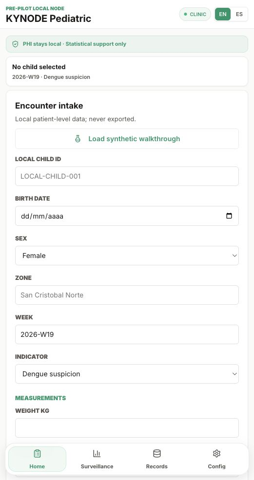
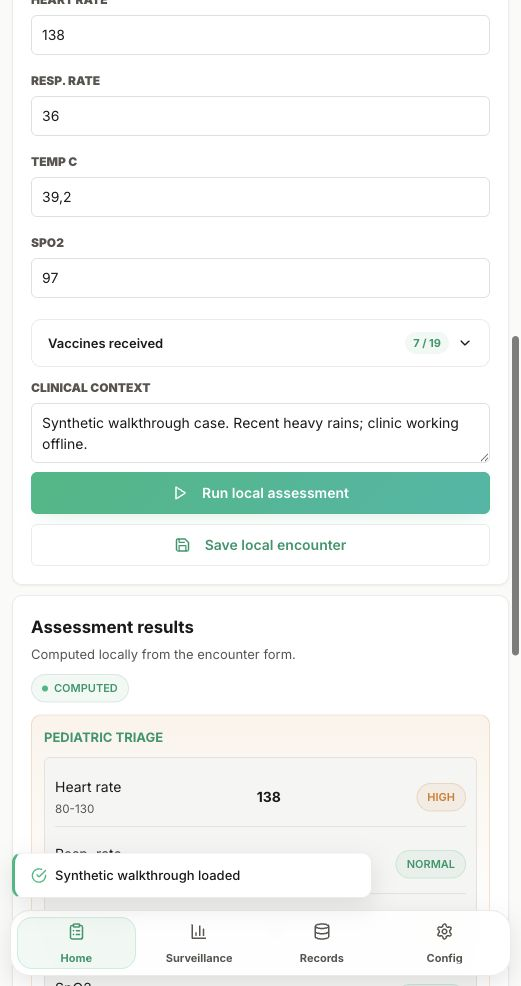
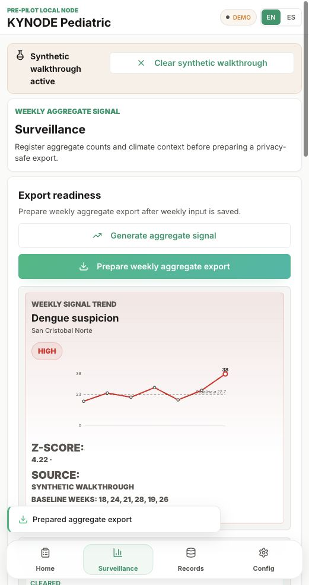
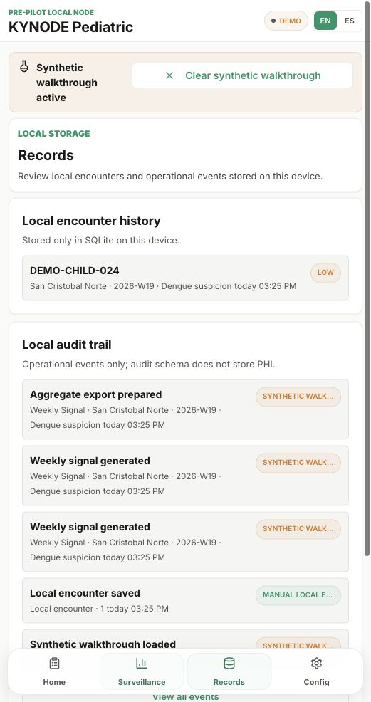
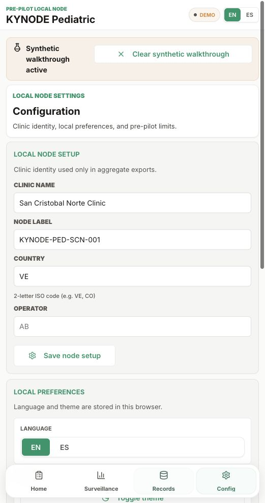

# Guía de Usuario · KYNODE Pediatric Local Node

Guía en español. Para inglés, ver [local-node.md](local-node.md).

Esta guía cubre el flujo pre-piloto del Local Node:

1. Capturar un encuentro pediátrico local.
2. Correr apoyo de evaluación offline.
3. Guardar el encuentro en SQLite local.
4. Registrar vigilancia semanal agregada.
5. Agregar contexto climático semanal.
6. Preparar una exportación JSON agregada sin PHI.

El Local Node es software pre-piloto. No está validado en campo y no provee diagnóstico autónomo.

> Las capturas muestran el layout móvil. El layout de escritorio usa las mismas cuatro vistas: Inicio, Vigilancia, Registros y Configuración.

## Iniciar El Nodo

Desde la raíz del repositorio:

```bash
python3 -m pip install -e packages/growth-curves
python3 -m pip install -e packages/triage-ranges
python3 -m pip install -e packages/anomaly-detection
python3 -m pip install -e packages/vaccinations
python3 -m pip install -e apps/local-node

python3 -m kynode_pediatric_local_node
```

Abrir:

```text
http://localhost:8080
```

La app inicia en **modo clínica**. No carga datos sintéticos a menos que el usuario active explícitamente el recorrido.



## Inicio: Capturar Un Encuentro Pediátrico

Usa **Inicio** para ingresar información del paciente que permanece en el dispositivo local:

- ID local del niño;
- fecha de nacimiento;
- sexo;
- zona;
- semana;
- indicador sindrómico;
- peso y signos vitales;
- vacunas recibidas;
- notas de contexto clínico.

Luego selecciona **Evaluar caso local**. El Local Node calcula:

- banderas de signos vitales pediátricos;
- bandera de crecimiento OMS;
- estado del esquema de vacunación;
- vista previa de indicador sindrómico.

Estos resultados son apoyo estadístico. No son diagnóstico y no recomiendan tratamiento.



Selecciona **Guardar encuentro local** cuando el encuentro deba quedar guardado en la base SQLite local.

## Recorrido Sintético

Usa **Cargar recorrido sintético** solo para demos, onboarding o QA.

El recorrido:

- llena el formulario con datos pediátricos sintéticos;
- registra vigilancia semanal sintética;
- registra contexto climático semanal sintético;
- marca el modo y toda señal/exportación agregada como sintética.

Usa **Limpiar recorrido sintético** antes de volver a captura clínica normal.

El modo clínica nunca carga datos sintéticos silenciosamente.

## Vigilancia: Señal Agregada Semanal

Usa **Vigilancia** para preparar la señal semanal por zona.

El registro semanal de vigilancia es agregado, no por niño:

- zona;
- semana epidemiológica;
- indicador;
- conteo agregado actual;
- conteos semanales base.

El contexto climático es una observación local estructurada para la misma zona/semana:

- lluvia;
- inundación;
- alerta de calor;
- interrupción de agua;
- riesgo vectorial;
- fuente;
- confianza;
- notas locales.

El pre-piloto no llama una API meteorológica, no predice clima y no atribuye causalidad entre contexto climático y casos.

Cuando existe el registro semanal, selecciona **Preparar exportación agregada**. El Local Node genera la señal, muestra la tendencia y prepara el JSON agregado seguro.



## Briefing de vigilancia

Cuando la exportación está lista, se habilita el panel **Briefing de vigilancia con IA** debajo. Presiona **Generar briefing** para producir un resumen en lenguaje claro de la misma señal agregada: titular, qué cambió esta semana, por qué requiere revisión, consideraciones operativas, límites de calidad de datos y una recomendación de escalamiento.

Por default el briefing lo genera una plantilla determinista basada en reglas que viene en el paquete y corre sin internet. Si el operador instaló Ollama (ver [Opcional · Capa de briefing con LLM local vía Ollama](../integrations/ollama.es.md)), el briefing lo genera un LLM local corriendo en la misma máquina o en un servidor dentro de la red de la clínica. Una compuerta clínica de seguridad se aplica a cada salida del LLM y silenciosamente cae a la plantilla determinista si el modelo produce frases de diagnóstico, prescripción, protocolo de tratamiento, dosis, atribución causal o brote confirmado.

El chip en la salida del briefing identifica qué generador corrió (`Plantilla determinista` o `LLM local · Ollama`). Cada briefing escribe un evento de auditoría `weekly_brief_generated` cuyo `source` lleva el nombre del generador.

## Frontera De Privacidad Del Export

La exportación está diseñada para compartir señal por zona. No debe contener:

- ID del niño;
- fecha de nacimiento;
- signos vitales individuales;
- peso o mediciones de crecimiento por niño;
- detalle de vacunas;
- notas clínicas;
- notas climáticas;
- iniciales del operador.

La UI muestra un checklist de privacidad antes de compartir la exportación agregada.

Contenido permitido:

- identidad del nodo;
- zona;
- semana;
- indicador;
- conteo agregado;
- estadísticas de línea base;
- bandera y severidad de la señal;
- contexto climático estructurado sin notas;
- advertencias de calidad;
- checklist de privacidad.

## Registros: Historial Local Y Auditoría

Usa **Registros** para revisar encuentros locales guardados y eventos operativos.

La auditoría guarda solo metadatos operativos. Registra eventos como cambios de configuración, guardado de encuentros, guardado de vigilancia semanal, guardado de contexto climático y preparación de exportación agregada.



## Configuración

Usa **Configuración** para identidad del nodo y preferencias locales.

Los campos de identidad del nodo se usan en exportaciones agregadas:

- nombre de clínica;
- etiqueta del nodo;
- país;
- iniciales del operador.

La página también muestra los límites operativos actuales del pre-piloto:

- solo SQLite local;
- sincronización en nube no configurada;
- v0.2.0-prepilot-local-node;
- política de respaldo y recreación de estructura de datos durante pre-piloto.



## Límites Actuales

Este Local Node pre-piloto todavía no incluye:

- login o roles;
- sincronización cloud;
- integración con API meteorológica;
- importación CSV;
- adaptadores DHIS2/OpenMRS;
- motor completo de reglas OMS IMCI;
- umbrales calibrados en campo.

Esos puntos quedan como trabajo de productización financiado por el grant.
